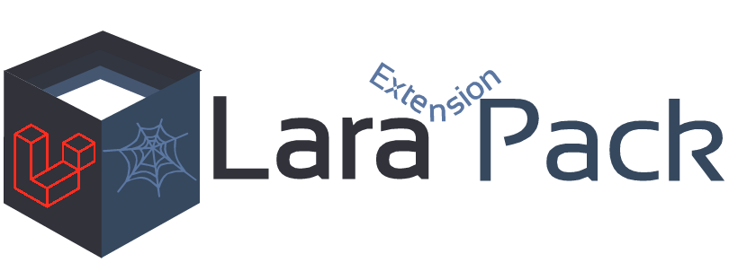

<<<<<<< .mine

# Lara Extension Pack

PHP Laravel extensions pack for VSCode.

---

## Extensions

The Lara Extension Pack includes:

<table>
  <tr>
    <td>Alpine.js IntelliSense</td>
    <td>
        
    </td>
    <td>
        
    </td>
    <td>
        
    </td>
  </tr>
  <tr>
    <td>Bootstrap 4, Font awesome 4, Font Awesome 5 Free & Pro snippets</td>
    <td>
        
    </td>
    <td>
        
    </td>
    <td>
        
    </td>
  </tr>
  <tr>
    <td>DotENV</td>
    <td>
        
    </td>
    <td>
        
    </td>
    <td>
        
    </td>
  </tr>
  <tr>
    <td>Git Graph</td>
    <td>
        
    </td>
    <td>
        
    </td>
    <td>
        
    </td>
  </tr>
  <tr>
    <td>Git History</td>
    <td>
        
    </td>
    <td>
        
    </td>
    <td>
        
    </td>
  </tr>
  <tr>
    <td>GitHub Pull Requests and Issues</td>
    <td>
        
    </td>
    <td>
        
    </td>
    <td>
        
    </td>
  </tr>
  <tr>
    <td>GitLens — Git supercharged</td>
    <td>
        
    </td>
    <td>
        
    </td>
    <td>
        
    </td>
  </tr>
  <tr>
    <td>Headwind</td>
    <td>
        
    </td>
    <td>
        
    </td>
    <td>
        
    </td>
  </tr>
  <tr>
    <td>HTML CSS Support</td>
    <td>
        
    </td>
    <td>
        
    </td>
    <td>
        
    </td>
  </tr>
  <tr>
    <td>Laravel Artisan</td>
    <td>
        
    </td>
    <td>
        
    </td>
    <td>
        
    </td>
  </tr>
  <tr>
    <td>Laravel Blade</td>
    <td>
        
    </td>
    <td>
        
    </td>
    <td>
        
    </td>
  </tr>
  <tr>
    <td>Laravel Blade formatter</td>
    <td>
        
    </td>
    <td>
        
    </td>
    <td>
        
    </td>
  </tr>
  <tr>
    <td>Laravel Blade Snippets</td>
    <td>
        
    </td>
    <td>
        
    </td>
    <td>
        
    </td>
  </tr>
  <tr>
    <td>Laravel Blade Spacer</td>
    <td>
        
    </td>
    <td>
        
    </td>
    <td>
        
    </td>
  </tr>
  <tr>
    <td>Laravel Blade Wrapper</td>
    <td>
        
    </td>
    <td>
        
    </td>
    <td>
        
    </td>
  </tr>
  <tr>
    <td>Laravel Create View</td>
    <td>
        
    </td>
    <td>
        
    </td>
    <td>
        
    </td>
  </tr>
  <tr>
    <td>Laravel Extra Intellisense</td>
    <td>
        
    </td>
    <td>
        
    </td>
    <td>
        
    </td>
  </tr>
  <tr>
    <td>Laravel goto view</td>
    <td>
        
    </td>
    <td>
        
    </td>
    <td>
        
    </td>
  </tr>
  <tr>
    <td>Laravel Snippets</td>
    <td>
        
    </td>
    <td>
        
    </td>
    <td>
        
    </td>
  </tr>
  <tr>
    <td>laravel-goto-components</td>
    <td>
        
    </td>
    <td>
        
    </td>
    <td>
        
    </td>
  </tr>
  <tr>
    <td>laravel-jump-controller</td>
    <td>
        
    </td>
    <td>
        
    </td>
    <td>
        
    </td>
  </tr>
  <tr>
    <td>Livewire Language Support</td>
    <td>
        
    </td>
    <td>
        
    </td>
    <td>
        
    </td>
  </tr>
  <tr>
    <td>npm Intellisense</td>
    <td>
        
    </td>
    <td>
        
    </td>
    <td>
        
    </td>
  </tr>
  <tr>
    <td>PHP Debug</td>
    <td>
        
    </td>
    <td>
        
    </td>
    <td>
        
    </td>
  </tr>
  <tr>
    <td>PHP Intelephense</td>
    <td>
        
    </td>
    <td>
        
    </td>
    <td>
        
    </td>
  </tr>
  <tr>
    <td>PHP IntelliSense</td>
    <td>
        
    </td>
    <td>
        
    </td>
    <td>
        
    </td>
  </tr>
  <tr>
    <td>Tailwind CSS IntelliSense</td>
    <td>
        
    </td>
    <td>
        
    </td>
    <td>
        
    </td>
  </tr>
</table>

---

## Release Notes

=======

# Lara Extension Pack

PHP Laravel extensions pack for VSCode.

---

## Extensions

The Lara Extension Pack includes:

<table>
  <tr>
    <td>Alpine.js IntelliSense</td>
    <td>
        
    </td>
    <td>
        
    </td>
    <td>
        
    </td>
  </tr>
  <tr>
    <td>Bootstrap 4, Font awesome 4, Font Awesome 5 Free & Pro snippets</td>
    <td>
        
    </td>
    <td>
        
    </td>
    <td>
        
    </td>
  </tr>
  <tr>
    <td>DotENV</td>
    <td>
        
    </td>
    <td>
        
    </td>
    <td>
        
    </td>
  </tr>
  <tr>
    <td>Git Graph</td>
    <td>
        
    </td>
    <td>
        
    </td>
    <td>
        
    </td>
  </tr>
  <tr>
    <td>Git History</td>
    <td>
        
    </td>
    <td>
        
    </td>
    <td>
        
    </td>
  </tr>
  <tr>
    <td>GitHub Pull Requests and Issues</td>
    <td>
        
    </td>
    <td>
        
    </td>
    <td>
        
    </td>
  </tr>
  <tr>
    <td>GitLens — Git supercharged</td>
    <td>
        
    </td>
    <td>
        
    </td>
    <td>
        
    </td>
  </tr>
  <tr>
    <td>Headwind</td>
    <td>
        
    </td>
    <td>
        
    </td>
    <td>
        
    </td>
  </tr>
  <tr>
    <td>HTML CSS Support</td>
    <td>
        
    </td>
    <td>
        
    </td>
    <td>
        
    </td>
  </tr>
  <tr>
    <td>Laravel Artisan</td>
    <td>
        
    </td>
    <td>
        
    </td>
    <td>
        
    </td>
  </tr>
  <tr>
    <td>Laravel Blade</td>
    <td>
        
    </td>
    <td>
        
    </td>
    <td>
        
    </td>
  </tr>
  <tr>
    <td>Laravel Blade formatter</td>
    <td>
        
    </td>
    <td>
        
    </td>
    <td>
        
    </td>
  </tr>
  <tr>
    <td>Laravel Blade Snippets</td>
    <td>
        
    </td>
    <td>
        
    </td>
    <td>
        
    </td>
  </tr>
  <tr>
    <td>Laravel Blade Spacer</td>
    <td>
        
    </td>
    <td>
        
    </td>
    <td>
        
    </td>
  </tr>
  <tr>
    <td>Laravel Blade Wrapper</td>
    <td>
        
    </td>
    <td>
        
    </td>
    <td>
        
    </td>
  </tr>
  <tr>
    <td>Laravel Create View</td>
    <td>
        
    </td>
    <td>
        
    </td>
    <td>
        
    </td>
  </tr>
  <tr>
    <td>Laravel Extra Intellisense</td>
    <td>
        
    </td>
    <td>
        
    </td>
    <td>
        
    </td>
  </tr>
  <tr>
    <td>Laravel goto view</td>
    <td>
        
    </td>
    <td>
        
    </td>
    <td>
        
    </td>
  </tr>
  <tr>
    <td>Laravel Snippets</td>
    <td>
        
    </td>
    <td>
        
    </td>
    <td>
        
    </td>
  </tr>
  <tr>
    <td>laravel-goto-components</td>
    <td>
        
    </td>
    <td>
        
    </td>
    <td>
        
    </td>
  </tr>
  <tr>
    <td>laravel-jump-controller</td>
    <td>
        
    </td>
    <td>
        
    </td>
    <td>
        
    </td>
  </tr>
  <tr>
    <td>Livewire Language Support</td>
    <td>
        
    </td>
    <td>
        
    </td>
    <td>
        
    </td>
  </tr>
  <tr>
    <td>npm Intellisense</td>
    <td>
        
    </td>
    <td>
        
    </td>
    <td>
        
    </td>
  </tr>
  <tr>
    <td>PHP Debug</td>
    <td>
        
    </td>
    <td>
        
    </td>
    <td>
        
    </td>
  </tr>
  <tr>
    <td>PHP Intelephense</td>
    <td>
        
    </td>
    <td>
        
    </td>
    <td>
        
    </td>
  </tr>
  <tr>
    <td>PHP IntelliSense</td>
    <td>
        
    </td>
    <td>
        
    </td>
    <td>
        
    </td>
  </tr>
  <tr>
    <td>Tailwind CSS IntelliSense</td>
    <td>
        
    </td>
    <td>
        
    </td>
    <td>
        
    </td>
  </tr>
</table>

---

## Release Notes

>>>>>>> .theirs
### 1.0.0
<<<<<<< .mine

New extension

### View [Change Log](https://github.com/edyspider/LaraExtensionPack/blob/master/CHANGELOG.md)

---

## Authors

* [**EdySpider**](https://github.com/edyspider/)

See also the list of [contributors](https://github.com/edyspider/LaraExtensionPack/contributors) who participated in this project.

---

## License

* **[MIT license](https://github.com/edyspider/LaraExtensionPack/blob/master/LICENSE)**
* Copyright 2024 &copy; <a href="https://github.com/edyspider" target="_blank">EdySpider</a>.
=======

New extension

### View [Change Log](https://marketplace.visualstudio.com/items/EdySpider.laraextensionpack/changelog)

---

## Authors

* [**EdySpider**](https://github.com/edyspider/)

See also the list of [contributors](https://github.com/edyspider/LaraExtensionPack/contributors) who participated in this project.

---

## License

* **[MIT license](https://github.com/edyspider/LaraExtensionPack/blob/master/LICENSE)**
* Copyright 2024 &copy; <a href="https://github.com/edyspider" target="_blank">EdySpider</a>.
>>>>>>> .theirs
